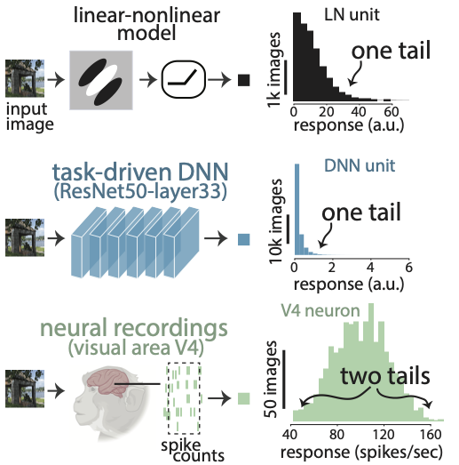

# Repository for 'A tale of two tails: Preferred and anti-preferred natural stimuli in visual cortex' ICLR2026

Code accompanying the paper [A tale of two tails: Preferred and anti-preferred natural stimuli in visual cortex](https://openreview.net/pdf?id=RZ8esDBqMJ) [1].


<p align="center">
  
</p>

[1] Gondur, R., Stan, P. L., Smith, M. A., & Cowley, B. R. (2025, October). A tale of two tails: Preferred and anti-preferred natural stimuli in visual cortex. In The Fourteenth International Conference on Learning Representations.

## Required Packages
```
- python 3.11.5
- torch 2.2.1
- keras 3.1.1
- tensorflow 2.16.1
- numpy 1.26.4
- matplotlib 3.8.3
- scipy 1.13.0
- scikit-learn 1.4.1
```

## General Guide
- Each directory in this repository contains the code used to generate results for the corresponding figure in our paper. **Note:** The code assumes you already have access to the V4 data and compact models. Please refer to this [repo](https://github.com/cshl/V4_compact_models) to download the V4 data and have access to compact models, called V4 model neurons in our paper. We also used 3 other publicly available neural datasets for our analysis in `fig2`, for more information on them, please see the references in our paper. 

## Citation

If you use any part of this code in your research, please cite our [paper](https://openreview.net/pdf?id=RZ8esDBqMJ):

```
@inproceedings{gondur2025tale,
  title={A tale of two tails: Preferred and anti-preferred natural stimuli in visual cortex},
  author={Gondur, Rabia and Stan, Patricia L and Smith, Matthew A and Cowley, Benjamin R},
  booktitle={The Fourteenth International Conference on Learning Representations},
  year={2025}
}
```

## License

This project is licensed under the MIT License -
see the [LICENSE](LICENSE) file for details
